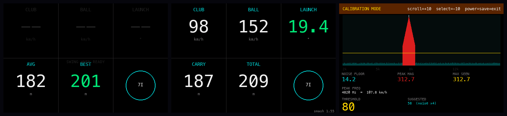

# OpenScope — DIY Golf Launch Monitor

A radar-based golf launch monitor. Measures ball speed, club speed,
**launch angle**, carry distance and total distance using two 24 GHz
Doppler radar modules and an ESP32 microcontroller. Battery-powered,
no phone required.

## Features

- Ball speed (km/h or mph)
- Club head speed
- **Launch angle** — measured from dual-radar Doppler ratio
- Carry & total distance — physics-corrected using actual launch angle
- Smash factor (serial output)
- 3.5" color TFT display
- Per-club statistics (avg, best carry) stored in flash
- Deep sleep with one-button wake
- Calibration mode with live FFT spectrum

## Technology

Two **CDM324 24 GHz K-band Doppler radars** — one horizontal, one
angled 20° upward — feed into a dual-channel LM358 preamplifier. The
ESP32 runs a 1024-point FFT on both channels simultaneously and derives
launch angle from the frequency ratio between them.

```
f_A = 2·v·cos(α)·fc/c         (Radar A, horizontal)
f_B = 2·v·cos(α−θ)·fc/c       (Radar B, tilted θ = 20° up)

f_A / f_B = cos(α) / cos(α−θ) → solve for α via binary search
```

Carry is then calculated using the measured launch angle as a trajectory
correction on top of empirical per-club factors.

## Project Phases

| Phase | Description | Status |
|-------|-------------|--------|
| 1 | Hardware & wiring | 🟡 In progress (v0.6) |
| 2 | Software & calibration | 🟡 In progress (v0.6) |
| 3 | Physical prototyping | 🔲 Not started |
| 4 | Housing & battery optimization | 🔲 Not started |
| 5 | Testing & validation | 🔲 Not started |

## Repository Structure

```
golf-launch-monitor/
├── src/
│   └── main.cpp          # ESP32 firmware (PlatformIO)
├── docs/
│   ├── bom.md            # Bill of materials with part numbers
│   ├── wiring.md         # Wiring diagram, radar mounting angles
│   └── openscope-ui.png  # UI mockup
├── platformio.ini        # PlatformIO build configuration
└── README.md
```

## Quick Start

1. Order components — see [docs/bom.md](docs/bom.md)
2. Wire up the circuit — see [docs/wiring.md](docs/wiring.md)
3. Mount the radars at the correct angles (see below)
4. Install [PlatformIO](https://platformio.org/)
5. Clone this repo and open in VS Code
6. Build & upload: `pio run --target upload`
7. Calibrate — see below

## Radar Mounting

This is the most important step for accurate launch angle measurement.

```
Side view:

                         ↗  Ball trajectory
                        /
          Radar B ────►/   20° above horizontal  (GPIO35)
                       /
─────────────────────────────────────────────────  Ground
          Radar A ─────────────────────────────►  horizontal  (GPIO34)
              │
           ~10 cm behind tee, aimed at impact point
```

- **Radar A** — mount perfectly horizontal (use a spirit level).
- **Radar B** — mount tilted **20° upward**. Use a printed wedge or
  protractor. Both radars side by side, ≤ 5 cm apart.
- If you use a different angle, update `#define RADAR_B_ANGLE_DEG` in
  `src/main.cpp` to match.

## Controls

Three dedicated buttons:

| Button | GPIO | Normal mode | Calibration |
|--------|------|-------------|-------------|
| Scroll | 25 | Cycle clubs | Threshold +10 |
| Select | 26 | Open settings | Threshold −10 |
| Power | 27 | Hold 2 s → sleep | Hold 2 s → save + exit |

## Display Layout

All screens share the same 3×2 tile grid:

```
┌──────────┬──────────┬──────────┐
│  CLUB    │  BALL    │  LAUNCH  │
│  98      │  152     │  19.4    │
│  km/h    │  km/h    │  °       │
├──────────┼──────────┼──────────┤
│  CARRY   │  TOTAL   │   (7I)   │
│  187     │  209     │          │
│  m       │  m       │          │
└──────────┴──────────┴──────────┘
```

The Launch tile turns **green** when both radars detect the shot and a
valid angle is computed. It shows `--` (dimmed) when only one radar
fired — carry then falls back to an empirical estimate.

## Calibration

The detection threshold tells the firmware what signal level counts as
a real shot vs. background noise. It is saved to flash.

### Enter calibration

From the main screen, press **Select** → scroll to **Calibration** →
press **Select** again.

```
┌──────────────────────────────────────────────────────┐
│  CALIBRATION MODE    scroll=+10  select=-10  power=save│
├──────────────────────────────────────────────────────┤
│  [live FFT spectrum — teal bars below threshold,      │
│   red bars above — yellow line = threshold]           │
├───────────────┬───────────────┬──────────────────────┤
│ NOISE FLOOR   │ PEAK MAG      │ MAX SEEN             │
│ 14.2          │ 14.2          │ 14.2                 │
├───────────────┴───────────────┴──────────────────────┤
│ PEAK FREQ:  ---                                       │
│ THRESHOLD: 80        SUGGESTED: 58  (noise x4)       │
└──────────────────────────────────────────────────────┘
```

### Steps

1. Leave the device still for ~30 s. Note **NOISE FLOOR** (typically 8–20).
2. Take a full practice swing. Note **MAX SEEN** (typically 200–600).
3. Use **Scroll (+10)** / **Select (−10)** to move the yellow threshold
   line between noise floor and MAX SEEN. The **SUGGESTED** value
   (`noise × 4`) is a good starting point.
4. Hold **Power 2 s** to save and return.

| Measurement | Typical value |
|-------------|--------------|
| Noise floor | 10–20 |
| Shot peak | 200–600 |
| Good threshold | 60–100 |

> Raise the threshold if you get false triggers. Lower it if real shots
> are not detected.

## How it works

The CDM324 emits a continuous 24.125 GHz signal. Moving objects
Doppler-shift the reflected signal:

```
f_d = 2 × v × f_c / c
v [km/h] = f_d [Hz] × 0.022384
```

The ESP32 samples both radar channels simultaneously at 40 kHz and runs
a 1024-point FFT (~25 ms window). Two peaks per frame are searched —
the lower frequency is club head speed, the higher is ball speed.

**Launch angle** is computed from the ratio of the two radar frequencies
and refined with a 40-iteration binary search. Ball speed is then
corrected for the measured angle (`v_true = v_horizontal / cos(α)`),
and carry is scaled using the trajectory shape (`sin(2α)`) relative to
each club's typical launch angle.

## UI Mockup



## License

MIT
