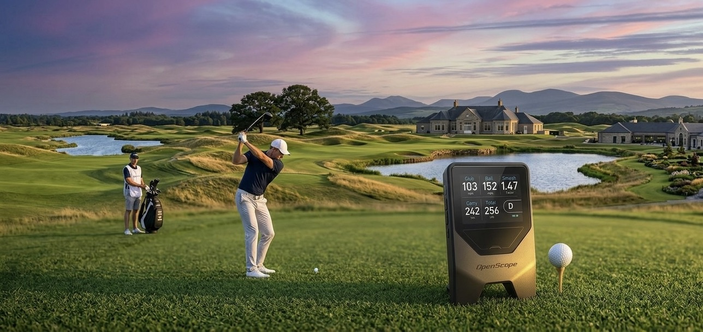

# OpenScope — DIY Golf Launch Monitor

A radar-based golf launch monitor built around a **single** 24 GHz Doppler
radar module and an ESP32, modelled on the commercial single-Doppler
[Shot Scope LM1](https://shotscope.com/). Measures ball speed, club speed
and smash factor directly, and estimates carry and total distance.
Battery-powered, no phone required.

## What it measures (and what it can't)

A single Doppler sensor sees only speed along its line of sight. That is
enough for the core launch-monitor metrics, but **not** for launch angle,
spin, or shot direction — those need extra sensors. OpenScope is honest
about the difference:

| Metric | Source |
|--------|--------|
| Ball speed | **Measured** — post-impact Doppler peak |
| Club head speed | **Measured** — pre-impact clubhead Doppler peak |
| Smash factor | **Measured** — ball speed ÷ club speed |
| Carry distance | **Modeled** — from ball speed + per-club ballistic factor |
| Total distance | **Modeled** — carry + per-club rollout factor |
| Launch angle | **Not available** — needs a second/elevated sensor |
| Spin (back/side) | **Not available** — out of reach for plain Doppler |
| Side angle / dispersion | **Not available** — needs ≥2 sensors |

Other features:

- Units in km/h · m or mph · yds
- 3.5" color **touch** TFT display (ILI9488 + XPT2046)
- Per-club statistics (avg, best carry) stored in flash
- Deep sleep with one-button wake
- Calibration mode with live FFT spectrum

## Technology

One **CDM324 24 GHz K-band Doppler radar** feeds into an LM358
preamplifier. The ESP32 samples the IF signal at 40 kHz and runs a
1024-point Hamming-windowed FFT (~25 ms window). Within that window the
spectrum can hold two peaks — the slower **clubhead** (pre-impact) and the
faster **ball** (post-impact):

```
CDM324 emits a continuous 24.125 GHz tone. A moving object Doppler-shifts
the reflection:

  f_d = 2 · v · f_c / c
  v [km/h] = f_d [Hz] × 0.022384

The unit sits in line with the shot, so the radar sees the true
line-of-sight speed — no angle correction is needed:

  ball speed  = (higher peak) × 0.022384 km/h
  club speed  = (lower  peak) × 0.022384 km/h
  smash       = ball speed ÷ club speed
  carry       = ball speed × club.carry_f      (modeled)
  total       = carry × (1 + club.roll_f)      (modeled)
```

## Project Phases

| Phase | Description | Status |
|-------|-------------|--------|
| 1 | Hardware & wiring | 🟡 In progress (v0.7) |
| 2 | Software & calibration | 🟡 In progress (v0.7) |
| 3 | Physical prototyping | 🔲 Not started |
| 4 | Housing & battery optimization | 🔲 Not started |
| 5 | Testing & validation | 🔲 Not started |

## Repository Structure

```
golf-launch-monitor/
├── src/
│   ├── config.h          # pins, FFT/Doppler constants, layout
│   ├── radar.cpp/.h      # ADC sampling, FFT, peak detection
│   ├── clubs.cpp/.h      # club table + per-club stats
│   ├── display.cpp/.h    # all TFT drawing, themes, gestures, hit-testing
│   ├── storage.cpp/.h    # NVS persistence
│   └── main.cpp          # touch UI state machine, sleep, main loop
├── test/
│   └── test_speed_from_fft/  # native smoke test (pio test -e native)
├── docs/
│   ├── bom.md            # Bill of materials with part numbers
│   ├── wiring.md         # Wiring diagram, radar placement
│   └── openscope-ui.png  # UI mockup
├── platformio.ini        # PlatformIO build configuration
└── README.md
```

## Quick Start

1. Order components — see [docs/bom.md](docs/bom.md)
2. Wire up the circuit — see [docs/wiring.md](docs/wiring.md)
3. Place the unit ~1.4 m behind the ball, facing the target (see below)
4. Install [PlatformIO](https://platformio.org/)
5. Clone this repo and open in VS Code
6. Build & upload: `pio run --target upload`
7. Calibrate — see below

## Radar Placement

Place the unit on the ground **~1.4 m (4–5 ft) behind the ball**, in line
with the hitting direction, with the sensor/screen facing the target —
the same geometry the Shot Scope LM1 uses. The ball flies *away* from the
unit; Doppler measures a receding object identically to an approaching one.

```
Top view:

 [Unit] ──── ~1.4 m ────► ●  →  →  →  target
  (on ground,            ball
   facing target)
```

- One CDM324 module, flat on the ground, boresight pointing at the target.
- Aim it down the intended shot line through the ball.
- Keep it static — vibration adds noise.

> **Speed-training tip:** to read swing speed alone, place the unit ~2.1 m
> behind the golfer instead.

## Controls

**Touch screen + one Power button.** All navigation is by touch; the only
physical control is Power (hold 2 s anywhere → sleep / shut down).

| Screen | Touch |
|--------|-------|
| Main menu | Tap **Start Session**, **Settings**, or **Shut Down** |
| Mode select | Tap **Practice Range**, **On Course**, or **Speed Training** · **‹ Back** |
| Session | Tap the **club pill** → picker · **swipe ←/→** switch layout · tap a metric (Advanced) → Large Digit · **⚙ Menu** → Settings · **‹ Back** → mode select |
| Large Digit | **Swipe ↑/↓** cycle metric (club → ball → smash → carry → total) |
| Result | Tap **anywhere** → dismiss |
| Club picker | **Swipe ↑/↓** scroll · tap a club → select · **‹ Back** keeps current |
| Settings | Tap a **row** to toggle/open · **‹ Back** → exit |
| Calibration | `[−10]` `[SAVE]` `[+10]` buttons |

> A **left-edge swipe-right** also acts as **Back** on sub-screens. On first
> boot (or via Settings → **Touch Cal.**) the unit runs a quick 4-corner touch
> calibration, stored in flash.

## Display Layout

Navigation is **Main menu → Mode select → Session**, modelled on the Shot
Scope LM1. A session shows shot data in one of two swipeable layouts, in either
a **Black** (white labels) or **Blue** (cyan labels) theme — both set in
Settings.

### Advanced — 3×2 tile grid

```
┌──────────┬──────────┬──────────┐
│  CLUB    │  BALL    │  SMASH   │
│  98      │  152     │  1.55    │
│  km/h    │  km/h    │          │
├──────────┼──────────┼──────────┤
│  CARRY   │  TOTAL   │ ┌──────┐ │
│  187     │  209     │ │  7I  │ │  ← tap the club pill → picker
│  m       │  m       │ └──────┘ │
├──────────┴──────────┴──────────┤
│ ‹ Back   SWIPE L/R: LAYOUT   ⚙ Menu │
└────────────────────────────────┘
```

The five tiles are the five single-Doppler metrics: **club speed**, **ball
speed**, **smash factor** (measured) plus **carry** and **total** (modeled).

- **Smash** tile turns green when a club peak was found; `--` (dimmed) if only
  the ball was detected, in which case Club and Smash both read `--`.

### Large Digit — one metric, full size

```
┌─────────────────────────────────┐
│         Total Distance          │
│                      ┌──────┐   │
│         209          │  7I  │   │
│          m           └──────┘   │
│                                 │
│ ‹ Back  SWIPE U/D: METRIC  ⚙ Menu │
└─────────────────────────────────┘
```

Swipe **left/right** to switch Advanced ⇄ Large Digit; in Large Digit, swipe
**up/down** to cycle club speed → ball speed → smash → carry → total.

### Speed Training

A single huge **swing-speed** number (the dominant Doppler peak) for swing-speed
practice — no club selection or distance modelling.

### Settings screen

Reached from the main menu, or the **⚙ Menu** gear during a session.

```
┌─────────────────────────────────────────────┐
│ ‹ Back              Settings                  │
├─────────────────────────────────────────────┤
│▌ Units                              Kmh/m   │
│▌ Color                              Black   │
│▌ Layout                          Advanced   │
│▌ Reset Stats                          7I    │
│▌ Radar Cal.                            ►    │
│▌ Touch Cal.                            ►    │
└─────────────────────────────────────────────┘
```

| Item | Action |
|------|--------|
| Units | Toggle **Kmh/m** ↔ **Mph/Yds** |
| Color | **Black** ↔ **Blue** theme |
| Layout | **Advanced** ↔ **Large Digit** |
| Reset Stats | Clears avg/best for the active club |
| Radar Cal. | Opens the detection-threshold calibration screen |
| Touch Cal. | Re-runs the 4-corner touch calibration |

## Calibration

The detection threshold tells the firmware what signal level counts as
a real shot vs. background noise. It is saved to flash.

### Enter calibration

From the main menu → **Settings** → **Radar Cal.**

```
┌──────────────────────────────────────────────────────┐
│  CALIBRATION MODE              tap the buttons below  │
├──────────────────────────────────────────────────────┤
│  [live FFT spectrum — teal bars below threshold,      │
│   red bars above — yellow line = threshold]           │
├───────────────┬───────────────┬──────────────────────┤
│ NOISE FLOOR   │ PEAK MAG      │ MAX SEEN             │
│ 14.2          │ 14.2          │ 14.2                 │
├───────────────┴───────────────┴──────────────────────┤
│ PEAK 0 Hz = 0.0 km/h                                  │
│ THRESHOLD 80         SUGGESTED 58                     │
├───────────────┬───────────────┬──────────────────────┤
│     −10       │     SAVE      │       +10            │
└───────────────┴───────────────┴──────────────────────┘
```

### Steps

1. Leave the device still for ~30 s. Note **NOISE FLOOR** (typically 8–20).
2. Take a full practice swing. Note **MAX SEEN** (typically 200–600).
3. Tap **`−10`** / **`+10`** to move the yellow threshold line between
   noise floor and MAX SEEN. The **SUGGESTED** value (`noise × 4`) is a
   good starting point.
4. Tap **SAVE** (or hold **Power 2 s**) to save and return.

| Measurement | Typical value |
|-------------|--------------|
| Noise floor | 10–20 |
| Shot peak | 200–600 |
| Good threshold | 60–100 |

> Raise the threshold if you get false triggers. Lower it if real shots
> are not detected.

## How it works

The ESP32 samples the radar IF at 40 kHz and runs a 1024-point Hamming FFT
(~25 ms window). Within each frame up to two peaks are searched, at least
`MIN_PEAK_SEP_HZ` apart: if their ratio looks like a plausible ball/club
pair, the **lower** frequency is the clubhead and the **higher** is the
ball; otherwise only ball speed is reported. Parabolic interpolation gives
sub-bin frequency accuracy. Each peak is converted to speed with
`HZ_TO_KMH`; smash is the ratio, and carry/total are modeled per club.

Because the unit is aligned with the shot line, the radar reads true
line-of-sight speed — there is no V-formation, no triangulation, and no
angle correction. See [the source](src/radar.cpp) for the signal chain and
[`test/`](test/) for a host-side smoke test of the speed-from-FFT path
(`pio test -e native`).

## UI Mockup


## License

MIT
